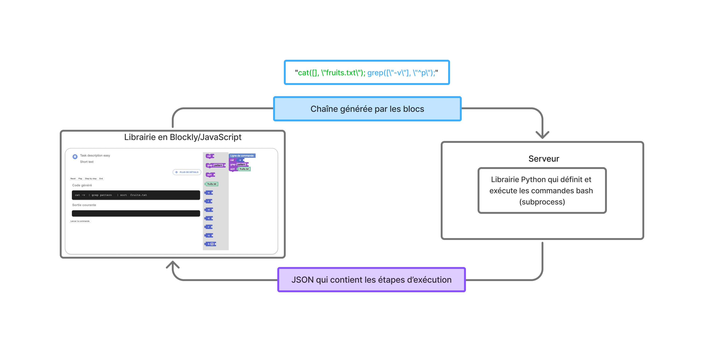

# Unix Filters

## Présentation

Ce projet a été réalisé pendant mon stage de troisième année de licence d'Informatique à l'Université de Lille.\
**Objectif**: Créer une interface web pédagogique qui permet à l’utilisateur de s’initier aux filtres Unix en utilisant la programmation par blocs (avec Blockly)

## Architecture globale

Le projet est composé de deux grandes parties :

- Frontend : interface web en JavaScript qui utilise la libriarie Blockly de Google : [/public](public)
- Backend : librairie Python qui permet l'exécution des commandes Bash avec le module subprocess : [/python_lib](python_lib)

### Interface Blockly/JavaScript

.public/\
├── blocklyUnixFilters_lib.js --> librairie contenant la définition des blocs\
├── index.css --> style de la page html\
├── index.html --> contenu de la tâche\
├── jsongenerator.js --> génération du code pour chaque bloc\
├── task.js --> contient les paramètres de la tâche (blocs disponibles, nombre de blocs autorisés,...)\
└── unixfilters.js --> logique de l'affichage et de l'envoi de la commande au serveur

#### Aide

- [Ajouter un bloc](./docs/lib_js/add_block.md)

### Librairie Python

.python_lib/\
├── commands.py --> librairie définissant les différents filtres et exécutant la commande\
└── server.py --> reçoit le code généré par les blocs et utilise la librairie pour récupérer le résultat et le renvoyer au front

#### Aide

- [Ajouter une commande](./docs/lib_py/add_command.md)

## Format d'échange des données

Le schéma ci-dessous montre le fonctionnement global du système :

1. L'utilisateur construit une commande via l'interface Blockly
2. Le code généré est envoyé au serveur Python via une requête HTTP
3. Le serveur exécute la commande en utilisant la librairie Python et retourne l'objet JSON en sortie
4. L'interface affiche le résultat à l'utilisateur



### Getting started

Cloner le repo

```bash
git clone https://github.com/waningcrescendo/unixfilters-franceIOI.git
```

#### Mode développement

Ajouter le repo bebras-modules dans le dossier public

```bash
cd unixfilters-franceIOI/public
git clone https://github.com/France-ioi/bebras-modules.git
```

Mettre en place l'environnement virtuel pour le serveur Python

```bash
cd ../python_lib
```

```bash
python3 -m venv venv
```

- Sur **Linux/macOS** :

```bash
source venv/bin/activate
```

- Sur **Windows** :

```bash
venv\Scripts\activate
```

Installer flask et lancer le serveur python dans un environnement virtuel

```bash
pip install flask-cors
```

```bash
python3 server.py
```

Installer les dépendances et lancer le serveur node à la racine unixfilters-franceIOI

```bash
npm install
```

```bash
node server.js
```

URL en développement : http://localhost:3000

##### Tester une tâche localement

1. Générer un code Blockly depuis l'interface

2. Copier le code généré par les blocs dans solutoon.py
   (maintenant : Lors du clic sur le bouton **_Exécuter_**, le code est enregistré dans tests/gen/solution.py)
   Exemple :

```python
cut(["-d", " ", "-f", "2,4", "commandes.txt"])
sort(["-t", "' '", "-k", "2,2nr"])
head(["-n", "5"])
```

3. Lancer le test :

```bash
python3 tests/gen/commands.py < tests/files/test01.in > tests/files/test01.solout
python3 tests/gen/checker.py tests/files/test01.solout tests/files/test01.in tests/files/test01.out
```

#### Production

Envoyer les fichiers sur le SVN (on verra plus tard)
